# Step by Step instructions to deploy a GitOps Ready Stack + Demo NodeJS App
For this GitOps stack we will be leveraging a variety of tools:
 - CircleCI
 - ArgoCD
 - Platform9 Managed Kubernetes Freedom
 - Example NodeJS app to be leveraged in your demo

**CircleCI** is a modern continuous integration and continuous delivery (CI/CD) platform. You can learn more about CircleCI at: https://circleci.com/docs/2.0/about-circleci/

**ArgoCD** is a declarative, GitOps continuous delivery tool for Kubernetes. You can find more information about this project at: https://argoproj.github.io/argo-cd/

**Platform9 Managed Kubernetes Freedom** provides to you pure-play open source Kubernetes that is delivered as a SaaS managed service. The Freedom plan is a zero-cost plan that offers a capacity of up to 3 clusters and 20 nodes (or 800 vCPUs), community Slack support, and built-in critical alerting. You can sign up here: https://platform9.com/signup/

When you follow these instructions you will get something like the below flow:


## Setup of a Platform9 Managed Kubernetes Freedom cluster
While the process is very straightforward, you can find the documentation to create a Platform9 Managed Kubernetes cluster here: https://docs.platform9.com/kubernetes/introduction/freedom-plan-faq/

## Example NodeJS app
In this setup we will be showcasing the instructions for a NodeJS application which is based upon the default react-app. This repo also contains the required files you'll use later on for CircleCI (eg. `.circleci`, `dockerfile`, etc.)
Clone the KoolKubernetes repo on GitHub, and cd into `cicd/gitops-stack/webapp01`. When you issue `npm install` followed with `npm start`, the application should open up in a browser. 
```Compiled successfully!

You can now view react-app01 in the browser.

  Local:            http://localhost:3000
  On Your Network:  http://192.168.1.246:3000

Note that the development build is not optimized.
To create a production build, use npm run build.

```
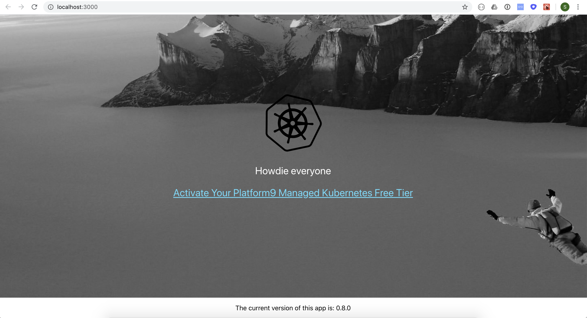

There are three main files: 
The index.html file is the template that will be sent to the browser, while the code for the application reside in src/App.js. In package.json you can find some parameters of the app. The most useful parameters in this file are the `version` and `name` parameters.


## CircleCI Setup
*Optionally: Sign up for a CircleCI Free plan in case you do not yet have a CircleCI account. In case you have a Free or Enterprise account feel free to leverage this one as well*
You can create a CircleCI account at https://circleci.com/signup/ where you can opt for authentication via GitHub. To make life very easy, you can give CircleCI access to work with all your repos.
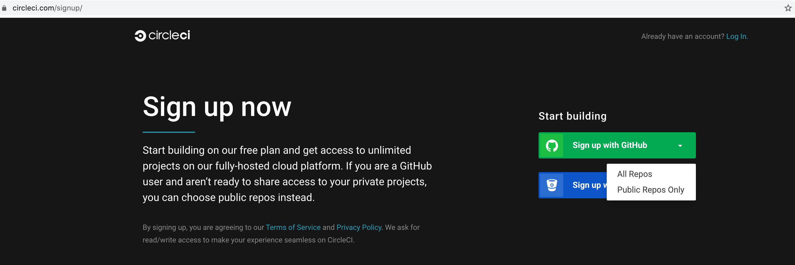

While the configuration of CircleCI is super intuitive and you can find detailed instructions at https://circleci.com/docs/2.0/getting-started/#section=getting-started, please find below some quick instructions to get things going.
1. Setup a CircleCI Project: Select  **Set Up Project** next to the repo you want to follow with CircleCI - in this example we'll be following the KoolKubernetes repo
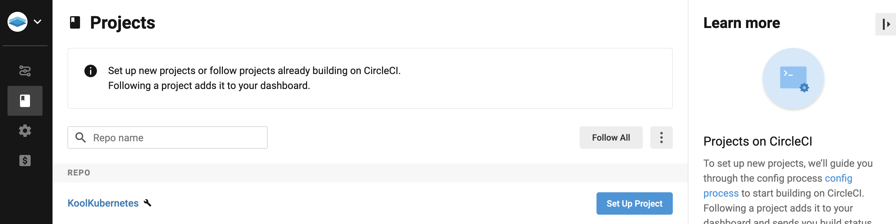
2. CircleCI offers a variety of config templates. Just select **Node** and click on **Start Building**
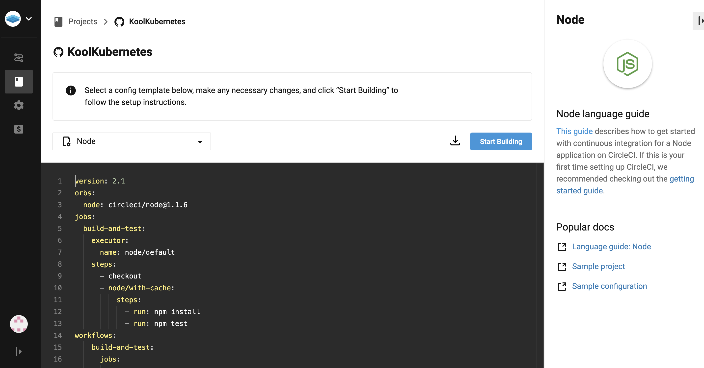
3. In the cloned repo you will find an example config file so you can select **Add Manually** and copy `KoolKubernetes/cicd/gitops-stack/.circleci` with its contents to the root of your repository. You do have to update the `.circleci/config.yml` with your Docker repo details. There is also an example dockerfile that you can put in the root of your repo. Once both files are added to your repo you can click on **Start Building**
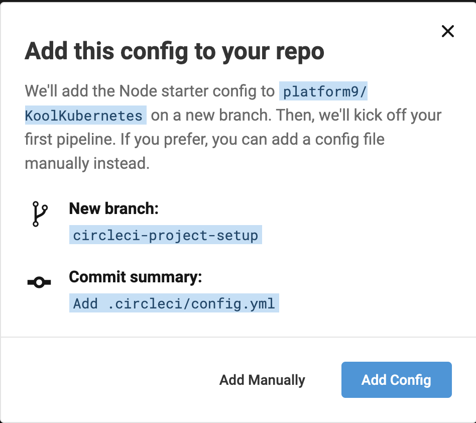
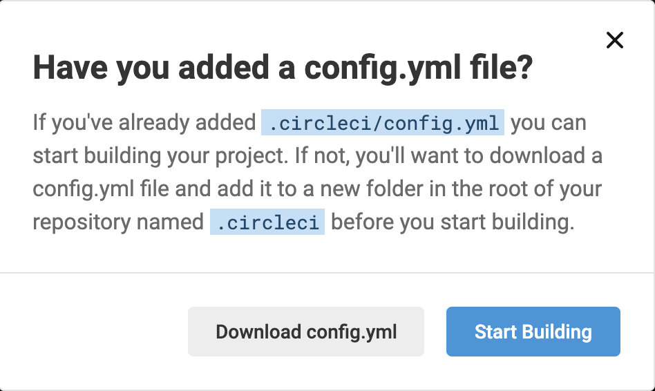

You will see that a pipeline job will kick off automatically which will probably fail due to some `missing environment variables`
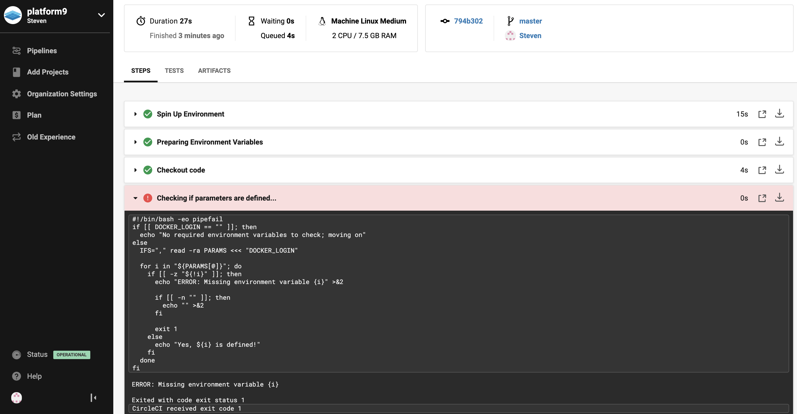
To resolve this you need to add `DOCKER_LOGIN` and `DOCKER_PASSWORD` as environment variables by going to **Project Settings** - **Environment Variables** - **Add Environment Variable**
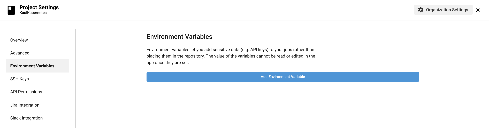
The value is your Docker user/org name and password
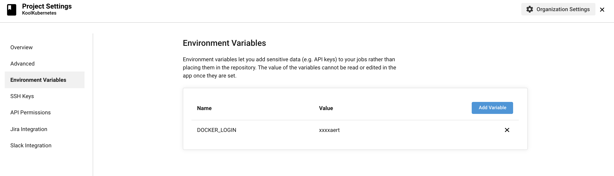

Next time you commit a change to the followed repository, you will notice that a new pipeline job is triggered which should complete fine. 
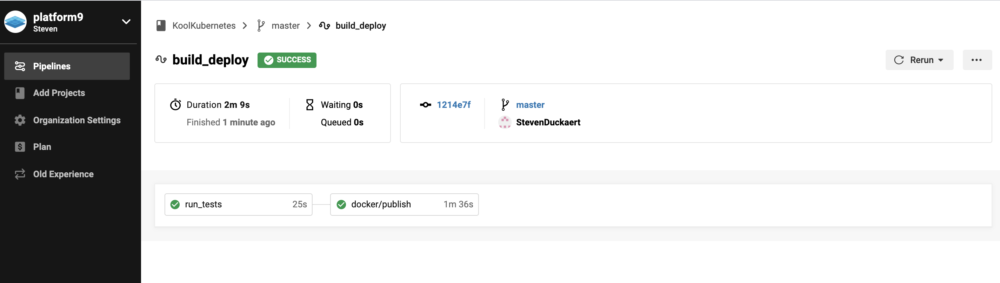
In your Docker repo you will also find the image that we can use for the CD part of the demo.
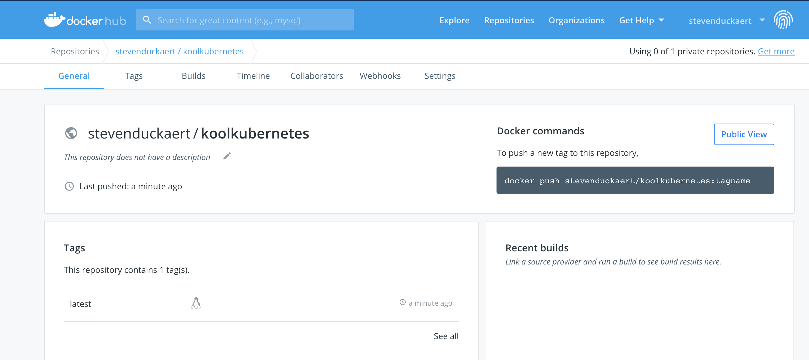

You are all set with CircleCI - feel free to add your own jobs/steps in the `.circleci/config.yml` file.

## Deployment of ArgoCD on one of your Platform9 Managed Kubernetes clusters
*Optionally: create a dedicated namespace for ArgoCD*
```bash
kubectl create namespace argocd
```
`
namespace/argocd created
`
```bash
kubectl apply -n argocd -f https://raw.githubusercontent.com/argoproj/argo-cd/stable/manifests/install.yaml
```
`
customresourcedefinition.apiextensions.k8s.io/applications.argoproj.io created
customresourcedefinition.apiextensions.k8s.io/appprojects.argoproj.io created
serviceaccount/argocd-application-controller created
serviceaccount/argocd-dex-server created
serviceaccount/argocd-server created
role.rbac.authorization.k8s.io/argocd-application-controller created
role.rbac.authorization.k8s.io/argocd-dex-server created
role.rbac.authorization.k8s.io/argocd-server created
clusterrole.rbac.authorization.k8s.io/argocd-application-controller created
clusterrole.rbac.authorization.k8s.io/argocd-server created
rolebinding.rbac.authorization.k8s.io/argocd-application-controller created
rolebinding.rbac.authorization.k8s.io/argocd-dex-server created
rolebinding.rbac.authorization.k8s.io/argocd-server created
clusterrolebinding.rbac.authorization.k8s.io/argocd-application-controller created
clusterrolebinding.rbac.authorization.k8s.io/argocd-server created
configmap/argocd-cm created
configmap/argocd-rbac-cm created
configmap/argocd-ssh-known-hosts-cm created
configmap/argocd-tls-certs-cm created
secret/argocd-secret created
service/argocd-dex-server created
service/argocd-metrics created
service/argocd-redis created
service/argocd-repo-server created
service/argocd-server-metrics created
service/argocd-server created
deployment.apps/argocd-application-controller created
deployment.apps/argocd-dex-server created
deployment.apps/argocd-redis created
deployment.apps/argocd-repo-server created
deployment.apps/argocd-server created
`

### Install the Argo CD CLI on your computer.
For Mac you can use brew: 
```bash
brew tap argoproj/tap
brew install argoproj/tap/argocd
```
By default, the Argo CD API server is not exposed with an external IP. To access the API server, choose one of the following techniques to expose the Argo CD API server:

#### Option 1: Service Type Load Balancer
Change the argocd-server service type to `LoadBalancer`:
```bash
kubectl patch svc argocd-server -n argocd -p '{"spec": {"type": "LoadBalancer"}}'
```
#### Option 2: Ingress
Follow the ingress documentation on how to configure Argo CD with ingress: https://argoproj.github.io/argo-cd/operator-manual/ingress/

#### Option 3: Port Forwarding
Kubectl port-forwarding can also be used to connect to the API server
```bash
kubectl port-forward svc/argocd-server -n argocd 8080:443
```
The API server can then be accessed using the `localhost:8080`

### Connect & Configure ArgoCD
Retrieve the password of the Argo CD API server
```bash
kubectl get pods -n argocd -l app.kubernetes.io/name=argocd-server -o name | cut -d'/' -f 2
```
You can now logon to the Argo CD UI with the `retrieved` password and the `admin` user

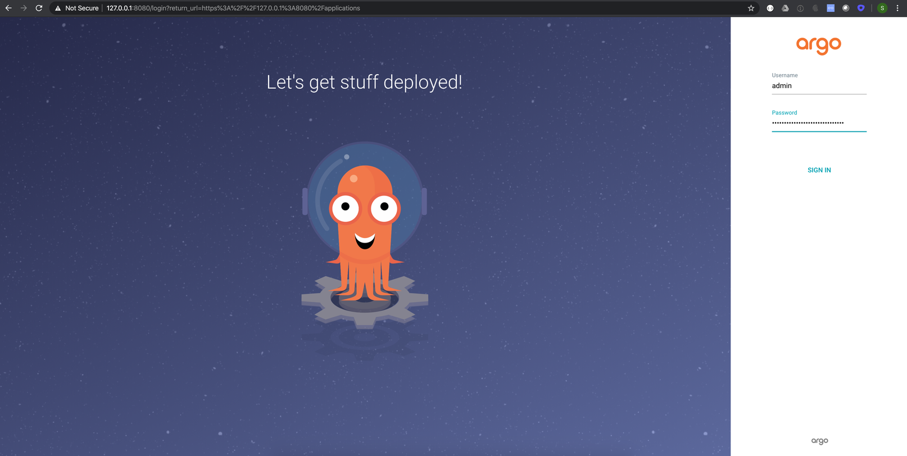
You can change the auto-generated password using the argocd CLI
```bash
argocd login 127.0.0.1:8080
```
`
WARNING: server certificate had error: x509: cannot validate certificate for 127.0.0.1 because it doesn't contain any IP SANs. Proceed insecurely (y/n)? y
Username: admin
Password:
'admin' logged in successfully
Context '127.0.0.1:8080' updated
`
```bash
argocd account update-password   
```
```
Enter current password:
Enter new password:
Confirm new password:
Password updated      
```

### *Optional*: Add  your remote Kubernetes cluster(s) to ArgoCD

#### kubectx
In the below example we're using Kubectx which is a nice addon to easily switch between clusters back and forth. You can find  [here](https://github.com/ahmetb/kubectx) more information about Kubectx

List all cluster contexts that are currently loaded
```
kubectx
```
```
cicd
edg01
edg02
```
```bash
argocd cluster add edg01
argocd cluster add edg02
```

```
INFO[0001] ServiceAccount "argocd-manager" created in namespace "kube-system"
INFO[0001] ClusterRole "argocd-manager-role" created
INFO[0001] ClusterRoleBinding "argocd-manager-role-binding" created
Cluster 'https://<<IP API Server>>' added
```


## Create a new app in ArgoCD
You will find an example Kubernetes manifest in `/webapp01/k8s/app.yaml` . Do make sure to update the parameters such as the Docker image details accordingly

Before you'll be able to create a new app, you first need to add your repository into ArgoCD.
Via the ArgoCD UI you can easily add your GitHub repository by selecting the **settings** icon on the left,  **Repositories** and **+CONNECT REPO USING HTTPS**
After completing your GitHub information, select **Connect**
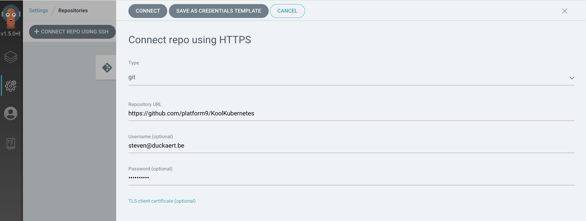

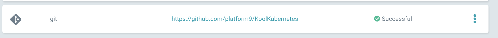


Now you can add a new application via the ArgoCD UI. Select **+ NEW APP** and enter the correct information in the fields. A YAML example below:
```apiVersion: argoproj.io/v1alpha1
kind: Application
metadata:
  name: platform9-webapp01
spec:
  destination:
    namespace: webapp01
    server: 'https://kubernetes.default.svc'
  source:
    path: cicd/gitops-stack/webapp01/k8s
    repoURL: 'https://github.com/platform9/KoolKubernetes'
    targetRevision: HEAD
  project: default
  syncPolicy:
    automated: null
```

Since the sync policy in the above example is set to `manual` you will need to select the Synchronize button. 
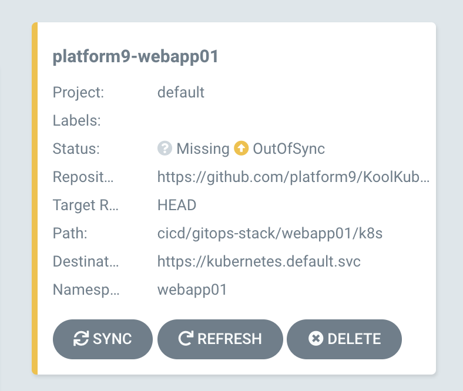
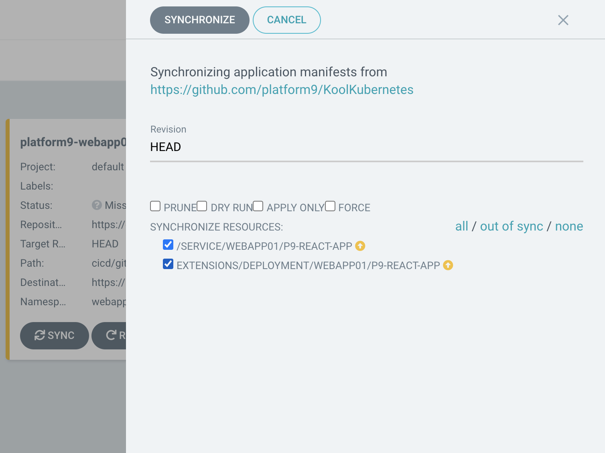


Once synchronized you will be able to see that the pods are deployed according to the `webapp01/k8s/app.yaml` manifest.
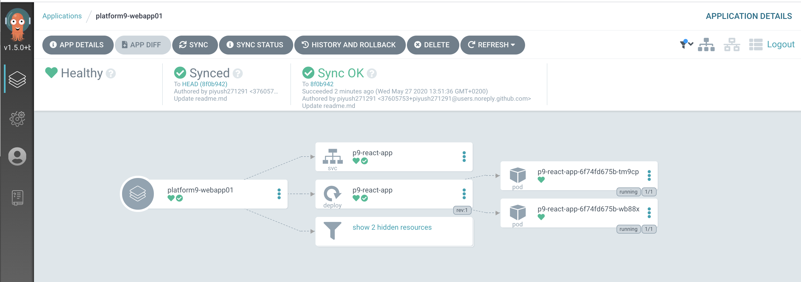

Kubectl output:

```
kubectl get pods -n webapp01                                                                                      
NAME                            READY   STATUS    RESTARTS   AGE
p9-react-app-6f74fd675b-tm9cp   1/1     Running   0          27s
p9-react-app-6f74fd675b-wb88x   1/1     Running   0          27s
```


## Demo Time
Let's update the version parameters of your application. To ensure consistency update the version field in the below two files:
1. /webapp01/package.json
2. /webapp01/k8s/app.yaml

If you now commit/push these changes into your Git repo, then you'll notice:
1. Automatic CI pipeline triggered in CircleCI
2. Once completed, your ArgoCD application will out-of-sync which you'll be able to synchronize (manually due to the set policy)

Output of the kubectl describe deployment command - version label should be updated. You can of course also connect to the app itself via it's service and checkout the version at the bottom of the UI.

```kubectl describe deployment platform9-webapp -n webapp01 
Name:                   platform9-webapp
Namespace:              webapp01
CreationTimestamp:      Wed, 27 May 2020 14:25:38 +0200
Labels:                 app.kubernetes.io/instance=platform9-webapp01
Annotations:            deployment.kubernetes.io/revision: 1
                        kubectl.kubernetes.io/last-applied-configuration:
                          {"apiVersion":"extensions/v1beta1","kind":"Deployment","metadata":{"annotations":{},"labels":{"app.kubernetes.io/instance":"platform9-weba...
Selector:               app=platform9-webapp
Replicas:               2 desired | 2 updated | 2 total | 2 available | 0 unavailable
StrategyType:           RollingUpdate
MinReadySeconds:        0
RollingUpdateStrategy:  1 max unavailable, 1 max surge
Pod Template:
  Labels:  app=platform9-webapp
           version=0.9.0
  Containers:
   platform9-webapp:
    Image:        stevenduckaert/koolkubernetes
    Port:         80/TCP
    Host Port:    0/TCP
    Environment:  <none>
    Mounts:       <none>
  Volumes:        <none>
Conditions:
  Type           Status  Reason
  ----           ------  ------
  Available      True    MinimumReplicasAvailable
OldReplicaSets:  <none>
NewReplicaSet:   platform9-webapp-6665465fdf (2/2 replicas created)
Events:
  Type    Reason             Age   From                   Message
  ----    ------             ----  ----                   -------
  Normal  ScalingReplicaSet  103s  deployment-controller  Scaled up replica set platform9-webapp-6665465fdf to 2
```

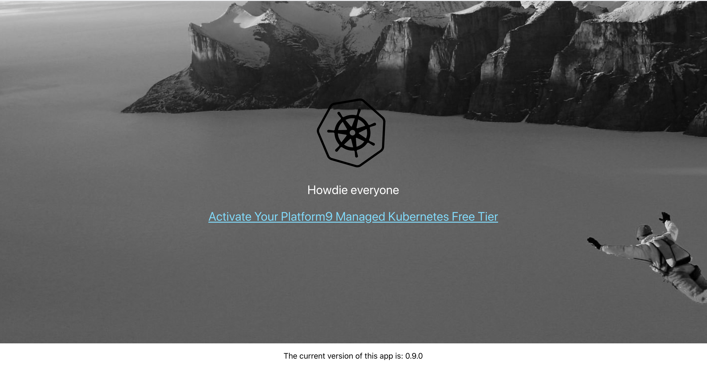

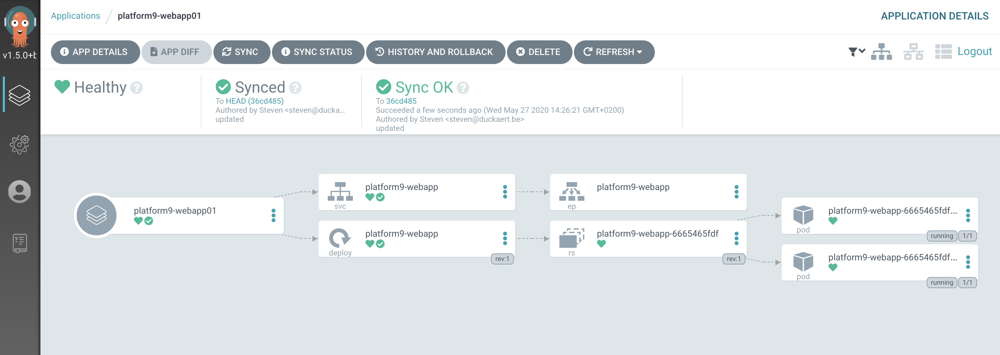